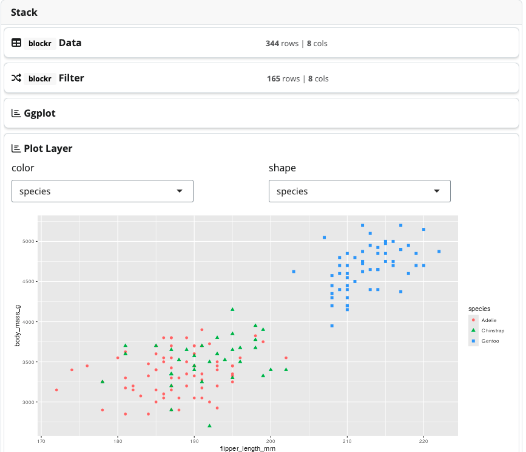

<!-- README.md is generated from README.Rmd. Please edit that file -->

# blockr

<!-- badges: start -->

[](https://github.com/blockr-org/blockr/actions/workflows/ci.yml)
[](https://codecov.io/github/blockr-org/blockr)
<!-- badges: end -->

> {blockr} is Shiny’s WordPress (John Coene, 2024)

## Why blockr?

`{blockr}` is an R package designed to democratize data analysis by
providing a flexible, intuitive, and **code-free** approach to building
data pipelines. It allows users to create **powerful** data workflows
using pre-built **blocks** that can be easily **connected**, all without
writing a single line of code.

<!-- -->

To get started, we invite you to read this
[vignette](https://blockr-org.github.io/blockr/articles/blockr.html).

To get a better idea of `{blockr}` capabilities in various data context,
you can look at this
[vignette](https://blockr-org.github.io/blockr/articles/blockr_examples.html).

## Key features

1.  **User-Friendly Interface**: Build data pipelines with intuitive
    interface.
2.  **Flexibility**: Easily add, remove, or rearrange blocks in your
    pipeline.
3.  **Extensibility**: Developers can create custom blocks to extend
    functionality.
4.  **Reproducibility**: Pipelines created with `blockr` are easily
    shareable and reproducible, with exportable code.
5.  **Interactivity**: Real-time feedback as you build and modify your
    pipeline.

## Installation

You can install the development version of blockr from
[GitHub](https://github.com/) with:

``` r
pak::pak("blockr-org/blockr")
```

## Example: palmer penguins case study

Below is a simple case study involving `{blockr}`. We use the
palmerpenguins dataset to find out which femal species has the largest
flippers. We create 2 custom blocks allowing to create our plot block
(see the plot vignette for more details). Note that the
`{blockr.ggplot2}` package exposes some ready to use blocks.

``` r
library(blockr)
library(palmerpenguins)
library(ggplot2)

new_ggplot_block <- function(col_x = character(), col_y = character(), ...) {

  data_cols <- function(data) colnames(data)

  new_block(
    fields = list(
      x = new_select_field(col_x, data_cols, type = "name"),
      y = new_select_field(col_y, data_cols, type = "name")
    ),
    expr = quote(
      ggplot(mapping = aes(x = .(x), y = .(y)))
    ),
    class = c("ggplot_block", "plot_block"),
    ...
  )
}

new_geompoint_block <- function(color = character(), shape = character(), ...) {

  data_cols <- function(data) colnames(data$data)

  new_block(
    fields = list(
      color = new_select_field(color, data_cols, type = "name"),
      shape = new_select_field(shape, data_cols, type = "name")
    ),
    expr = quote(
      geom_point(aes(color = .(color), shape = .(shape)), size = 2)
    ),
    class = c("plot_layer_block", "plot_block"),
    ...
  )
}

stack <- new_stack(
  data_block = new_dataset_block("penguins", "palmerpenguins"),
  filter_block = new_filter_block("sex", "female"),
  plot_block = new_ggplot_block("flipper_length_mm", "body_mass_g"),
  layer_block = new_geompoint_block("species", "species")
)
serve_stack(stack)
```

<div class="figure" style="text-align: center">


<p class="caption">
Penguins app demo
</p>

</div>

## Contribute

Easiest is to run `make`, otherwise:

1.  Install npm dependencies with `packer::npm_install()`
2.  Build CSS by running the script in `dev/sass.R`
