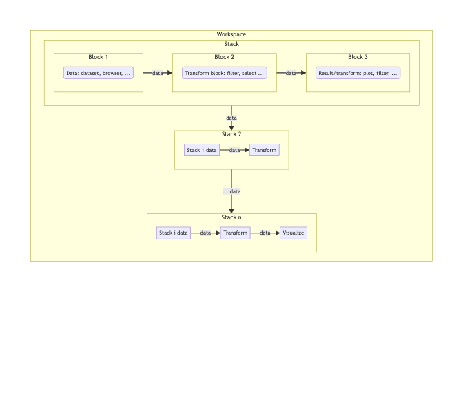

<!-- index.md is generated from index.Rmd. Please edit that file -->

# blockr

<!-- badges: start -->

[](https://github.com/blockr-org/blockr/actions/workflows/ci.yml)
[](https://codecov.io/github/blockr-org/blockr)
<!-- badges: end -->

> {blockr} is Shiny’s WordPress (John Coene, 2024)

## Why blockr?

`{blockr}` is an R package designed to democratize data analysis by
providing a flexible, intuitive, and **code-free** approach to building
data pipelines. It allows users to create **powerful** data workflows
using pre-built **blocks** that can be easily **connected**, all without
writing a single line of code.

<!-- -->

## Key features

1.  **User-Friendly Interface**: Build data pipelines with intuitive
    interface.
2.  **Flexibility**: Easily add, remove, or rearrange blocks in your
    pipeline.
3.  **Extensibility**: Developers can create custom blocks to extend
    functionality.
4.  **Reproducibility**: Pipelines created with `blockr` are easily
    shareable and reproducible, with exportable code.
5.  **Interactivity**: Real-time feedback as you build and modify your
    pipeline.

## Installation

You can install the development version of blockr from
[GitHub](https://github.com/) with:

``` r
pak::pak("blockr-org/blockr")
```

## Example: palmer penguins case study

Below is a simple case study involving `{blockr}`. We use the
palmerpenguins dataset to find out which femal species has the largest
flippers. We create 2 custom blocks allowing to create our plot block
(see the plot vignette for more details). Note that the
`{blockr.ggplot2}` package exposes some ready to use blocks.

<div class="card bslib-card bslib-mb-spacing html-fill-item html-fill-container"
data-bslib-card-init="" data-full-screen="false"
data-require-bs-caller="card()" data-require-bs-version="5">

<div class="card-body bslib-gap-spacing html-fill-item html-fill-container"
style="margin-top:auto;margin-bottom:auto;flex:1 1 auto;">

<iframe class="html-fill-item" src="https://shinylive.io/r/editor/#code=NobwRAdghgtgpmAXGKAHVA6ASmANGAYwHsIAXOMpMAdzgCMAnRRASwgGdSoAbbgCgA6YOtyIEA1gyG4ABAzioi7GQF4ZBQWAAWpUqnaIA9IZFjJAWiIMA5hmstSWgK50MLIodqNz8xe2kyQjp6Bsa+RBgM5tRQ7DAYVtZCAJTJAhDcLIxQDACefKYSDGkZWQw5+ag88AyoFNZObOwlmdl5fNbWqKKkAEwl6RBw1AD6nd1EpCOF4jIAPOYyAGZOEASk7hB8xNwjAB6q6lo5UOtwDHzJsjsjuYcEx+VnF1cyGO-JMiDp6TIyACZQLgjHbKBbLVbrTZ8QFcT47aDwdgwoFQAYQP5DUYzQQYv7LFhwbj-ZRqTKcXH4-EHNRYkbsIlwdYjJaE4nbIi7PayWFQEGc9iyUi5OqHISIuApXC-KkyO604b0xnM1lE-4c3a5Hmo-ncQUyYWitTi2CSsAlKlXGV-OB7VAMQ4ARyckzglNl4x6fBgaFQbGshygcGRNLefD2r3lYdyqQt+KteL+BG4sVJ6k0nsm01EEgCQgmUxmUutb3eMpKAF8fhA6dY4EQYIo2IWc7NwSs1hsSBqrPdHqdyC9ZOxjkajidnpdZO8MJ9vhAZbzdWDFh2od3efDORLkbyACSb6uYxU4kuq4lp8mkd1Una9hWjBncJlTc-qu8MbXA0FCkVwMWQKaxaJviI5oP+D5Ks+KpsuqYF1F+fI-gaf4ARKKQlgmVK2vaTouuQN74nWDYjE2ZB8EGyIfocGA9sUw6jhBYbwXAqTDiwABeTH9Jh0ogcmqb3JoBYjCmuTnNmZh5mAIlFuafFUjO5bpFWC4cFwEjzIsdKcKc4jukuMyHHSvIMi2ZjCfUjQcNJVTcDUdQQA0TTAX8smtsZiqZuZEiaEsmToBJz5OY4IwwDA0l0EQ-y5GFqZjK5MhiRJRmQcRjZEM2km+UI7B1AQhL+HggRgHlTKFRhEAlAyDAAG5wPSGn6bpEjJGAFYALpAA" height="700" width="100%" style="border: 1px solid rgba(0,0,0,0.175); border-radius: .375rem;" allowfullscreen allow="autoplay" data-external="1">
</iframe>

</div>

<bslib-tooltip placement="auto" bsOptions="[]" data-require-bs-version="5" data-require-bs-caller="tooltip()">
<template>Expand</template>
<span class="bslib-full-screen-enter badge rounded-pill"><svg xmlns="http://www.w3.org/2000/svg" viewBox="0 0 24 24" style="height:1em;width:1em;fill:currentColor;" aria-hidden="true" role="img"><path d="M20 5C20 4.4 19.6 4 19 4H13C12.4 4 12 3.6 12 3C12 2.4 12.4 2 13 2H21C21.6 2 22 2.4 22 3V11C22 11.6 21.6 12 21 12C20.4 12 20 11.6 20 11V5ZM4 19C4 19.6 4.4 20 5 20H11C11.6 20 12 20.4 12 21C12 21.6 11.6 22 11 22H3C2.4 22 2 21.6 2 21V13C2 12.4 2.4 12 3 12C3.6 12 4 12.4 4 13V19Z"/></svg></span>
</bslib-tooltip>
<script data-bslib-card-init>bslib.Card.initializeAllCards();</script>

</div>

``` r
library(blockr)
library(palmerpenguins)
library(ggplot2)

new_ggplot_block <- function(col_x = character(), col_y = character(), ...) {

  data_cols <- function(data) colnames(data)

  new_block(
    fields = list(
      x = new_select_field(col_x, data_cols, type = "name"),
      y = new_select_field(col_y, data_cols, type = "name")
    ),
    expr = quote(
      ggplot(mapping = aes(x = .(x), y = .(y)))
    ),
    class = c("ggplot_block", "plot_block"),
    ...
  )
}

new_geompoint_block <- function(color = character(), shape = character(), ...) {

  data_cols <- function(data) colnames(data$data)

  new_block(
    fields = list(
      color = new_select_field(color, data_cols, type = "name"),
      shape = new_select_field(shape, data_cols, type = "name")
    ),
    expr = quote(
      geom_point(aes(color = .(color), shape = .(shape)), size = 2)
    ),
    class = c("plot_layer_block", "plot_block"),
    ...
  )
}

stack <- new_stack(
  data_block = new_dataset_block("penguins", "palmerpenguins"),
  filter_block = new_filter_block("sex", "female"),
  plot_block = new_ggplot_block("flipper_length_mm", "body_mass_g"),
  layer_block = new_geompoint_block("species", "species")
)
serve_stack(stack)
```

## Contribute

Easiest is to run `make`, otherwise:

1.  Install npm dependencies with `packer::npm_install()`
2.  Build CSS by running the script in `dev/sass.R`
