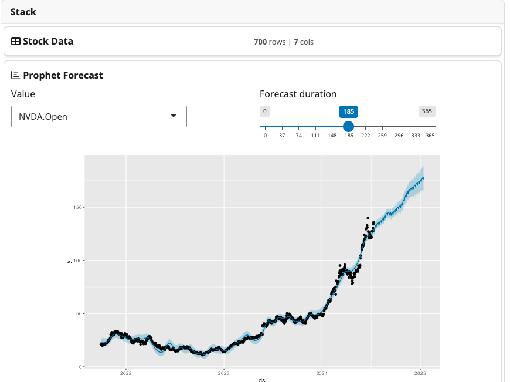
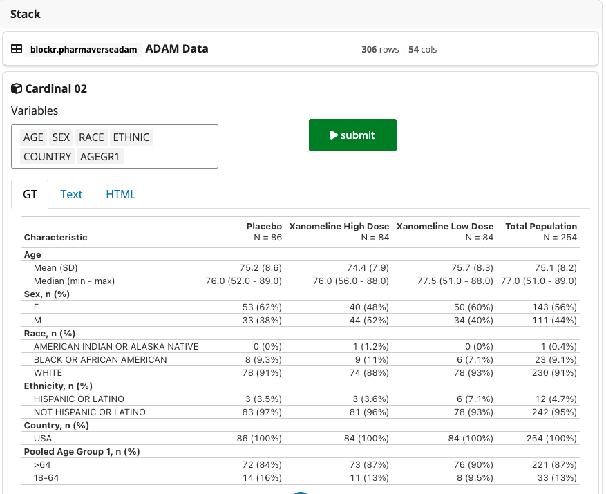
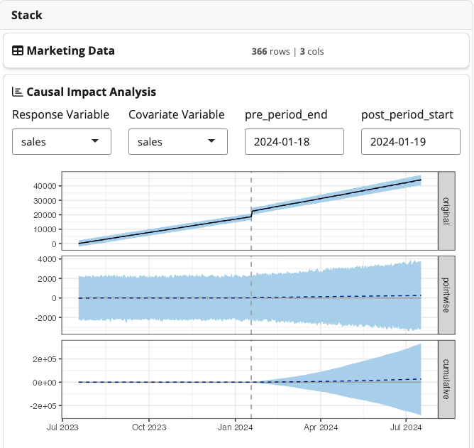

```{r setup, include=FALSE}
library(blockr)
library(bslib)
knitr::opts_chunk$set(echo = TRUE)
```

## blockr Across Industries

The __flexibility__ of `blockr` makes it valuable across various __industries__. Let's explore how it can be applied in different sectors with detailed examples. Some examples require to create a new field such as the `new_slider_field` described in the corresponding [vignette](https://bristolmyerssquibb.github.io/blockr/articles/new-field.html).

```{r slider_block, include=FALSE}
# Provided by John, new_range_field not working
new_slider_field <- function(value = 5L, min = 0L, max = 10L, step = 1L, ...) {
  blockr::new_field(
    value = value,
    min = min,
    max = max,
    step = step,
    ...,
    class = "slider_field"
  )
}

#' @method ui_input slider_field
#' @export
ui_input.slider_field <- function(x, id, name) {
  shiny::sliderInput(
    blockr:::input_ids(x, id),
    name,
    value = blockr::value(x, "value"),
    min = blockr::value(x, "min"),
    max = blockr::value(x, "max"),
    step = blockr::value(x, "step")
  )
}

#' @method validate_field slider_field
#' @export
validate_field.slider_field <- function(x) {
  x
}

#' @method ui_update slider_field
#' @export
ui_update.slider_field <- function(x, session, id, name) {
  updateSliderInput(
    session,
    blockr::input_ids(x, id),
    blockr::get_field_name(x, name),
    blockr::value(x),
    blockr::value(x, "min"),
    blockr::value(x, "max")
  )
}
```

```{r filter_block, include=FALSE}
#' Correlation plot
#' @param data dataset.
#' @param ... ignored.
#' @export
filter_in_block <- function(data, ...) {
  sub_fields <- \(data, column) {
    if (!length(column)) {
      column <- names(data)[1]
    }

    list(
      values = blockr::select_field(data[[column]][1], unique(data[[column]]), multiple = TRUE)
    )
  }

  fields <- list(
    column = blockr::new_select_field(
      \(data) names(data)[1],
      choices = \(data) names(data),
      title = "Column"
    ),
    values = blockr::new_list_field(character(), sub_fields)
  )

  blockr::new_block(
    fields = fields,
    expr = quote({
      vals <- unname(.(values))
      data |>
        dplyr::filter(!!dplyr::sym(.(column)) %in% vals[[1]])
    }),
    ...,
    class = c("filter_in_block", "transform_block"),
    submit = NA
  )
}

blockr::register_block(
  constructor = filter_in_block,
  name = "Filter in",
  description = "Filter on a vector",
  category = "transform"
)
```


### 1. Finance: Stock Price Forecasting

In this example, we'll create a pipeline that fetches recent stock data using the [quantmod package](https://github.com/joshuaulrich/quantmod), performs time series analysis, and forecasts future stock prices using the [Prophet model](https://github.com/facebook/prophet). We first design the `stock_data_block`, containing a field to select the stock items and generate the data. The `prophet_forecast_block` does all the modeling part.

```{r stock_example, eval=FALSE}
# Does not run on shinylive as quantmod/prophet not available
library(blockr)
library(quantmod)
library(prophet)

# Custom block to fetch stock data
new_stock_data_block <- function(...) {
  # stocks to pick (top 10)
  pick_stock <- \()  c("NVDA", "TSLA", "AAPL", "MSFT", "AVGO", "AMZN", "AMD", "PLTR", "TSM", "META")


  new_block(
    fields = list(
      ticker = new_select_field(pick_stock()[1], pick_stock, multiple = FALSE, title = "Ticker")
    ),
    expr = quote({
      data_xts <- getSymbols(.(ticker), src = "yahoo", auto.assign = FALSE)
      data.frame(Date = index(data_xts), coredata(data_xts)) |>
        tail(700) # only considering last 700 days for this example
    }),
    class = c("stock_data_block", "data_block"),
    ...
  )
}

# Custom block for Prophet forecasting
new_prophet_forecast_block <- function(columns = character(), ...) {
  all_cols <- function(data) colnames(data)[2:length(colnames(data))]


  new_block(
    fields = list(
      # date_col = new_select_field(columns, all_cols, multiple=FALSE, title="Date"),
      value_col = new_select_field(columns, all_cols, multiple = FALSE, title = "Value"),
      periods = new_slider_field(7, min = 0, max = 365, title = "Forecast duration")
    ),
    expr = quote({
      df <- data.frame(
        ds = data$Date,
        y = data[[.(value_col)]]
      )
      model <- prophet(df)
      future <- make_future_dataframe(model, periods = .(periods))
      forecast <- predict(model, future)
      plot(model, forecast)
    }),
    class = c("prophet_forecast_block", "plot_block"),
    ...
  )
}

block_input_check.plot_block <- function(x, data, ...) {

  if (inherits(data, "data.frame")) {
    return(invisible(NULL))
  }

  input_failure("Expecting data.frame input.")
}

block_output_ptype.plot_block <- function(x, ...) ggplot()

# Register custom blocks
register_block(
  new_stock_data_block,
  name = "Stock Data",
  description = "Fetch stock data",
  category = "data"
)
register_block(
  new_prophet_forecast_block,
  name = "Prophet Forecast",
  description = "Forecast using Prophet",
  category = "plot"
)

# Create the stack
stock_forecast_stack <- new_stack(
  new_stock_data_block(),
  new_prophet_forecast_block()
)

serve_stack(stock_forecast_stack)
```

```{r blockr-stock, echo=FALSE, fig.cap='Stock model demo', fig.align = 'center', out.width='100%'}

```

### 2. Pharmaceutical: Clinical Trial Analysis

#### 2.1 AE Forest Plot

This forest plot visualizes the relative risk of adverse events between two treatment arms in a clinical trial. In this case, it compares "Xanomeline High Dose" to "Xanomeline Low Dose" starting from the [pharmaverseadam](https://github.com/pharmaverse/pharmaverseadam) `adae` dataset. As you may notice, the `new_forest_plot_block` is a quite complex block. Part of the code is isolated in a function `create_ae_forest_plot` so that the main block constructor is more readable.

```{r, eval=TRUE, echo=FALSE}
card(
  blockr:::create_app_link(
    blockr:::shinylive_links["ae-forest-plot"],
    "editor",
    header = FALSE
  ),
  full_screen = TRUE
)
```

<p class="text-center">
<a 
class="btn btn-primary" 
data-bs-toggle="collapse" 
href="#forest-block" 
role="button" 
aria-expanded="false" 
aria-controls="forest-block">
Toggle code
</a>
</p>

<div class="collapse" id="forest-block">

```{r, results="asis", echo=FALSE, warning=FALSE, comment = ""}
blockr:::print_shinylive_r_code("ae-forest-plot")
```
</div>

#### 2.2 Demographics Table

This demographics table is taken from the `{cardinal}` package of [FDA Safety Tables and Figures](https://github.com/pharmaverse/cardinal) and demonstrates `{gt}` and `{rtables}` outputs starting from the [pharmaverseadam](https://github.com/pharmaverse/pharmaverseadam) `adsl` dataset. As a side note, the below block requires some extra helpers to work properly which you can find [here](https://github.com/blockr-org/blockr.cardinal/blob/72e6e5518d8226d4fdeb599b6e2e31ba03dc7c82/R/methods.R) in the `{blockr.cardinal}` package.

```{r cardinal_tables, eval=FALSE}
library(shiny)
library(blockr)
library(cardinal)
library(blockr.pharmaverseadam)

new_cardinal02_block <- function(...) {
  all_cols <- function(data) colnames(data)

  fields <- list(
    columns = new_select_field(
      c("SEX", "AGE", "AGEGR1", "RACE", "ETHNIC", "COUNTRY"),
      all_cols,
      multiple = TRUE,
      title = "Variables"
    )
  )

  expr <- quote({
    data <- droplevels(data)

    rtables <- cardinal::make_table_02(
      df = data,
      vars = .(columns)
    )

    gt <- cardinal::make_table_02_gtsum(
      df = data,
      vars = .(columns)
    )

    list(
      rtables = rtables,
      gt = gt
    )
  })

  new_block(
    expr = expr,
    fields = fields,
    ...,
    class = c("cardinal02_block", "rtables_block"),
    submit = NA
  )
}

block_input_check.rtables_block <- function(x, data, ...) {

  if (inherits(data, "data.frame")) {
    return(invisible(NULL))
  }

  input_failure("Expecting data.frame input.")
}

block_output_ptype.rtables_block <- function(x, ...) list()

register_block(
  new_cardinal02_block,
  "Cardinal 02",
  "A Cardinal 02 table",
  category = "table"
)


# Create the stack
rtables_stack <- new_stack(
  new_adam_block(selected = "adsl"),
  new_cardinal02_block()
)

serve_stack(rtables_stack)
```

```{r blockr-cardinal, echo=FALSE, fig.cap='Cardinal demo', fig.align = 'center', out.width='100%'}

```

### 3. Environmental Science: Air Quality Analysis and Prediction

This example demonstrates a pipeline for analyzing air quality data and predicting future pollution levels using actual data from the [openair](https://github.com/cran/openair) package.
This pipeline imports actual air quality data from the `{openair}` package and forecasts future pollution levels using an ARIMA model.

```{r environment, eval=FALSE}
library(blockr)
library(openair)
library(forecast)

# Custom block for air quality data import
new_air_quality_block <- function(...) {
  new_block(
    fields = list(
      site = new_select_field(
        "kc1",
        \() openair::importMeta()$code,
        multiple = FALSE,
        title = "Monitoring Site"
      ),
      start_year = new_numeric_field(
        2020,
        min = 1990,
        max = as.numeric(format(Sys.Date(), "%Y")),
        step = 1,
        title = "Start Year"
      ),
      end_year = new_numeric_field(
        as.numeric(format(Sys.Date(), "%Y")),
        min = 1990,
        max = as.numeric(format(Sys.Date(), "%Y")),
        step = 1,
        title = "End Year"
      )
    ),
    expr = quote({
      importAURN(site = .(site), year = .(start_year):.(end_year)) |> tail(700)
    }),
    class = c("air_quality_block", "data_block"),
    ...
  )
}


# Custom block for pollution forecasting
new_pollution_forecast_block <- function(columns = character(), ...) {
  all_cols <- function(data) setdiff(colnames(data), c("date", "site", "source"))

  new_block(
    fields = list(
      pollutant = new_select_field(columns, all_cols, multiple = FALSE, title = "Pollutant"),
      horizon = new_slider_field(
        30,
        min = 1,
        max = 365,
        step = 1,
        title = "Forecast Horizon (days)"
      )
    ),
    expr = quote({
      ts_data <- ts(na.omit(data[[.(pollutant)]]), frequency = 365)
      model <- auto.arima(ts_data)
      forecast_result <- forecast(model, h = .(horizon))
      plot(forecast_result, main = paste("Forecast of", .(pollutant), "levels"))
    }),
    class = c("pollution_forecast_block", "plot_block"),
    ...
  )
}

block_input_check.plot_block <- function(x, data, ...) {

  if (inherits(data, "data.frame")) {
    return(invisible(NULL))
  }

  input_failure("Expecting data.frame input.")
}

block_output_ptype.plot_block <- function(x, ...) ggplot()

# Register custom blocks
register_block(
  new_air_quality_block,
  name = "Air Quality Data",
  description = "Import air quality data",
  category = "data"
)

register_block(
  new_pollution_forecast_block,
  name = "Pollution Forecast",
  description = "Forecast pollution levels",
  category = "plot"
)

# Create the stack
air_quality_stack <- new_stack(
  new_air_quality_block(),
  new_pollution_forecast_block(columns = "no2")
)

serve_stack(air_quality_stack)
```

### 4. Marketing: Causal Impact Analysis of Marketing Interventions

This example demonstrates how to use [CausalImpact](https://google.github.io/CausalImpact/CausalImpact.html) to analyze the effect of marketing interventions on sales data. 
This pipeline generates dummy marketing data with an intervention, then uses `{CausalImpact}` to analyze the effect of the intervention on sales. This requires to define a new date field as shown below.

```{r date_field}
library(shiny)
new_date_field <- function(value = Sys.Date(), min = NULL, max = NULL, ...) {
  blockr::new_field(
    value = value,
    min = min,
    max = max,
    ...,
    class = "date_field"
  )
}

date_field <- function(...) {
  validate_field(new_date_field(...))
}

#' @method ui_input date_field
#' @export
ui_input.date_field <- function(x, id, name) {
  shiny::dateInput(
    blockr::input_ids(x, id),
    name,
    value = blockr::value(x, "value"),
    min = blockr::value(x, "min"),
    max = blockr::value(x, "max")
  )
}

#' @method validate_field date_field
#' @export
validate_field.date_field <- function(x, ...) {
  x
}

#' @method ui_update date_field
#' @export
ui_update.date_field <- function(x, session, id, name) {
  updateDateInput(
    session,
    blockr::input_ids(x, id),
    blockr::get_field_name(x, name),
    value = blockr::value(x),
    min = blockr::value(x, "min"),
    max = blockr::value(x, "max")
  )
}
```

```{r intervention_impact, eval=FALSE}
library(blockr)
library(CausalImpact)
library(dplyr)

# Custom block to load and prepare marketing data
new_marketing_data_block <- function(...) {
  new_block(
    fields = list(
      start_date = date_field(
        Sys.Date() - 365,
        min = Sys.Date() - 730,
        max = Sys.Date() - 1,
        label = "Start Date"
      ),
      intervention_date = date_field(
        Sys.Date() - 180,
        min = Sys.Date() - 729,
        max = Sys.Date(),
        label = "Intervention Date"
      ),
      end_date = date_field(
        Sys.Date(),
        min = Sys.Date() - 364,
        max = Sys.Date(),
        label = "End Date"
      )
    ),
    expr = quote({
      # Generate dummy data for demonstration
      dates <- seq(as.Date(.(start_date)), as.Date(.(end_date)), by = "day")
      sales <- cumsum(rnorm(length(dates), mean = 100, sd = 10))
      ad_spend <- cumsum(rnorm(length(dates), mean = 50, sd = 5))

      # Add intervention effect
      intervention_index <- which(dates == as.Date(.(intervention_date)))
      sales[intervention_index:length(sales)] <- sales[intervention_index:length(sales)] * 1.2

      data.frame(
        date = dates,
        sales = sales,
        ad_spend = ad_spend
      )
    }),
    class = c("marketing_data_block", "data_block"),
    ...
  )
}

# Custom block for CausalImpact analysis
new_causal_impact_block <- function(columns = character(), ...) {
  all_cols <- function(data) colnames(data)[2:length(colnames(data))]

  new_block(
    fields = list(
      response_var = new_select_field(
        columns,
        all_cols,
        multiple = FALSE,
        title = "Response Variable"
      ),
      covariate_var = new_select_field(
        columns,
        all_cols,
        multiple = FALSE,
        title = "Covariate Variable"
      ),
      pre_period_end = date_field(
        Sys.Date() - 181,
        min = Sys.Date() - 729,
        max = Sys.Date() - 1,
        label = "Pre-Period End Date"
      ),
      post_period_start = date_field(
        Sys.Date() - 180,
        min = Sys.Date() - 728,
        max = Sys.Date(),
        label = "Post-Period Start Date"
      )
    ),
    expr = quote({
      data <- data.frame(
        date = data$date,
        y = data[[.(response_var)]],
        x = data[[.(covariate_var)]]
      )
      pre_period <- c(min(as.Date(data$date)), as.Date(.(pre_period_end)))
      post_period <- c(as.Date(.(post_period_start)), max(as.Date(data$date)))

      impact <- CausalImpact(data, pre_period, post_period)
      plot(impact)
    }),
    class = c("causal_impact_block", "plot_block"),
    ...
  )
}

block_input_check.plot_block <- function(x, data, ...) {

  if (inherits(data, "data.frame")) {
    return(invisible(NULL))
  }

  input_failure("Expecting data.frame input.")
}

block_output_ptype.plot_block <- function(x, ...) ggplot()

# Register custom blocks
register_block(
  new_marketing_data_block,
  name = "Marketing Data",
  description = "Load and prepare marketing data",
  category = "data"
)
register_block(
  new_causal_impact_block,
  name = "Causal Impact Analysis",
  description = "Perform Causal Impact analysis on marketing data",
  category = "plot"
)

# Create the stack
marketing_impact_stack <- new_stack(
  new_marketing_data_block(),
  new_causal_impact_block()
)

serve_stack(marketing_impact_stack)
```

```{r blockr-marketing, echo=FALSE, fig.cap='Marketing demo', fig.align = 'center', out.width='100%'}

```

### 5. Dynamical systems

In the below example, we implemented the Lorenz attractor and solve it with the `{pracma}` R package (technically, the reason using `{pracma}` over `{deSolve}` or `{diffeqr}` is because only `{pracma}` is available for shinylive required by the embeded demo).

```{r, eval=TRUE, echo=FALSE}
card(
  blockr:::create_app_link(
    blockr:::shinylive_links["ode-demo"],
    "editor",
    header = FALSE
  ),
  full_screen = TRUE
)
```

<p class="text-center">
<a 
class="btn btn-primary" 
data-bs-toggle="collapse" 
href="#lorenz-mod" 
role="button" 
aria-expanded="false" 
aria-controls="lorenz-mod">
Toggle code
</a>
</p>

<div class="collapse" id="lorenz-mod">

```{r, results="asis", echo=FALSE, warning=FALSE, comment = ""}
blockr:::print_shinylive_r_code("ode-demo")
```
</div>
