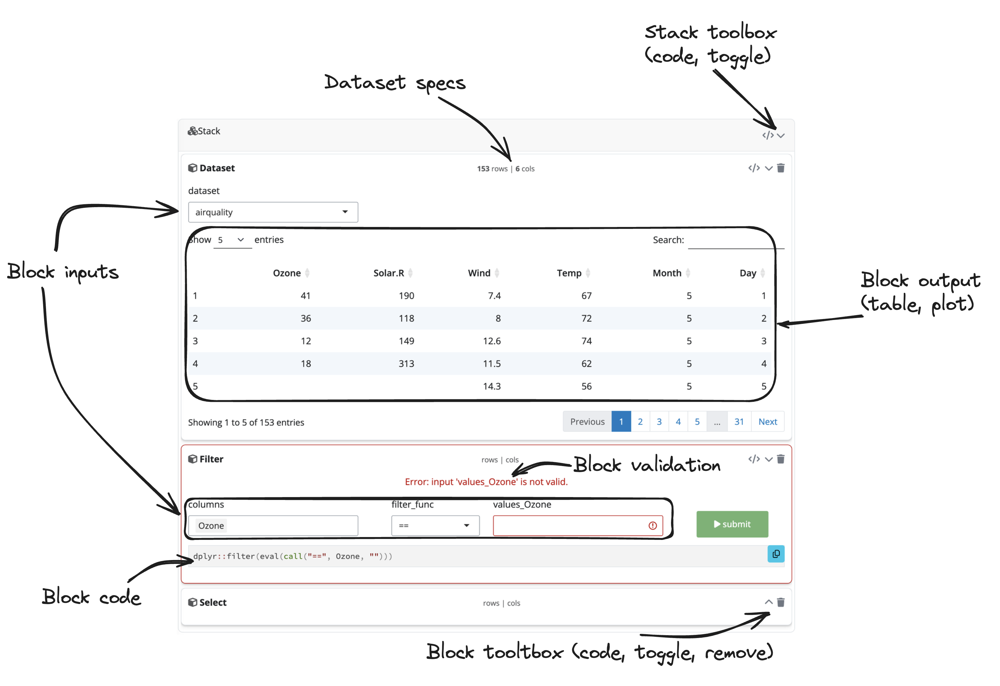

```{r, include = FALSE}
knitr::opts_chunk$set(
  collapse = TRUE,
  comment = "#>"
)
```

```{r setup, echo=FALSE, message=FALSE}
library(blockr)
library(bslib)
library(DiagrammeR)

note_box <- function(..., color) {
  htmltools::div(
    class = sprintf(
      "m-3 p-2 text-%s-emphasis bg-%s-subtle border border-%s-subtle rounded-3",
      color, color, color
    ),
    ...
  )
}
```

```{r echo=FALSE}
knitr::include_url("https://bristolmyerssquibb.github.io/useR2024")
```

# Get started

`{blockr}` provides plug and play __blocks__ which can be used to import, transform and visualize data. This guide provides an entry point for end users without extensive coding skills, as well as developers.

## {blockr} for non coders

In that case, you likely just want to get started to create your first data pipeline.

### The user interface

This is what the `{blockr}` interface looks. We designed it to be like a cooking __recipie__, where blocks correspond to the different __steps__.
Within each block are some __inputs__ that allow you to change parameters. For instance, when you import the data, you may want to select a given dataset or specify a file from your computer or on a server. In figure \@ref(fig:blockr-ui),
the `airquality` dataset is imported. On the top center of the block, you can see information about the number of rows and columns. Then, a filter block is added and target the `Ozone` column. Notice the __validation__ message as the value is missing. The submit button can't be clicked as long as the input is empty, which prevents from triggering errors in downstream blocks. Each block can be collapsed/uncollapsed and removed with the corresponding buttons located on the top right corner. As you can see, we group all related blocks inside a common container, the __stack__, which can also be collapse and removed.

```{r blockr-ui, echo=FALSE, fig.cap='User Interface Overview', fig.align = 'center', out.width='100%'}

```

### Starting from scratch

When you start from scratch, there are actually no blocks in the interface and you have to add them one by one.
To add a new block, you can click on the `+` icon on the stack top right corner. This opens a sidebar on the left side, where it is possible to search for blocks. To make things easier, all the suggested blocks are compatible with the current state of the pipeline. For instance, when the stack is empty, only entry point blocks are suggested, so you can import data. Then, after clicking on the block, the suggestion list changes so you can, for instance, filter data or select only a subset of columns, and more.

```{r, echo=FALSE}
# shinylive container
card(
  blockr:::create_app_link(
    blockr:::shinylive_links["empty-stack"],
    "app",
    header = FALSE
  ),
  full_screen = TRUE
)
```

### Toward a dashboard

What if you aim at creating a more ambitious pipeline? In that case, you don't need one cooking recipie but multiple, so you can organise your own dinner party. Below is a slightly more complex application, where you can add multiple stacks and connect them together. This are the following step to connect 2 stacks together:

- Click on "Add stack".
- Add a new dataset block with the default BOD dataset.
- Add a filter block. Target the Time column with values between 1 and 2, then click "submit". You should get only 2 rows.
- Click on "Add stack".
- Add a new result block in this second stack. You should see the same result as in the first stack.

Doing so, you can build you analysis step by step in a modular way.

```{r, echo=FALSE}
# shinylive container
card(
  blockr:::create_app_link(
    blockr:::shinylive_links["workspace-kitchen-sink"],
    "app",
    header = FALSE
  ),
  full_screen = TRUE
)
```

## {blockr} for developers

In the following section, we describe the building blocks behind blockr so you can start creating your blocks.

### Introduction

`{blockr}` aims at abstracting the logic behind common data pipeline tasks under __blocks__, without requiring any programming background. Besides, `{blockr}` exposes multiple tools so that advanced developers can easily extend it. We assume that a __stack__ is a succession of dependent blocks. We designed 3 kinds of blocks:

- __data__ block: entry level block to determine input data.
- __transform__ block: materialize `{dplyr}` operations on the selected data.
- __output__ (only plot for now) block: consumes transformed data to produce visualizations.

A __stack__ always starts from a data block and may end either by a transform blocks or an output block. This means that, at the moment, there can only be one output block per stack.

```{r, echo=FALSE}
mermaid("
  flowchart TD
  subgraph stack1[Stack]
    direction TB
    subgraph input_block[Block 1]
      input(Data: dataset, browser, ...)
    end
    subgraph transform_block[Block 2]
      transform(Transform block: filter, select ...)
    end
    subgraph output_block[Block 3]
      output(Result/transform: plot, filter, ...)
    end
    input_block --> |data| transform_block --> |data| output_block
  end
  ",
  height = "600px"
) |>
  htmlwidgets::onRender(
    "function(el, x) {
      el.classList.add('text-center')
    }
    "
  )
```

Under the hoods, blocks are composed of __fields__. The latter are translated into shiny inputs used to convey __interactivity__ within the block. As you can see in the below diagram, fields are combined to compute an __expression__, which eventually leads to a block __result__ after __evaluation__. For a data block, there is no data input.

```{r, echo=FALSE}
mermaid(
  "flowchart TD
  blk_data_in(Data input)
  blk_data_out[Output]
  subgraph blk_block[Block]
    subgraph blk_field1[Field 1]
      value(Value)
      title(Title)
      descr(Description)
      status(Status)
    end
    blk_field2(Field 2)
    blk_field1 --> blk_expr
    blk_field2 --> blk_expr
    blk_expr(Expression)
    blk_res(result)
    blk_expr --> blk_res
  end
  blk_data_in --> blk_block --> blk_data_out
  ",
  height = "800px"
) |>
  htmlwidgets::onRender(
    "function(el, x) {
      el.classList.add('text-center')
    }
    "
  )
```

For instance, if we assume a filter `{dplyr}` __expression__:

```{r, eval=FALSE}
data |> filter(col1 == "test")
```

This operation can be translated to `data |> filter(<COLNAME> <FILTER_FUNC> <FILTER_VALUE>, ...)`, where `<COLNAME>`, `<FILTER_FUNC>` and `<FILTER_VALUE>` are __fields__, to give the end user the ability to change the
expression. Note that fields may have dependencies, `<COLNAME>` controling the number of filters to apply. Besides, at the moment, our implementation of the filter block exposes additive operations, meaning that the result corresponds to `cond1 && cond2 && ...`.

```{r, echo=FALSE}
mermaid(
  "flowchart TD
  filt_data_in[Data input]
  filt_data_out[Transformed data]
  subgraph filt_block[Filter block]
    filt_select_col[Select columns]
    filt_filter_func[Filter function ==, !=]
    filt_filter_val[Filter values]
    filt_expr[Expression]
    filt_res[Result]

    filt_select_col --> filt_expr
    filt_select_col --> |depends| filt_filter_val
    filt_filter_val --> filt_expr
    filt_filter_func --> filt_expr

    filt_expr --> filt_res
  end
  filt_data_in --> filt_block --> filt_data_out
  ",
  height = "700px"
) |>
  htmlwidgets::onRender(
    "function(el, x) {
      el.classList.add('text-center')
    }
    "
  )
```

### Create a stack

To create a __stack__, you call `new_stack()` and feed it all the required __blocks__.
Below is a simple stack providing a dataset selector and a filter operation. `serve_stack()` is a simple
wrapper to run the corresponding shiny app. Note that with `serve_stack()`, you don't need to worry about
specifying any __modules IDs__, they are automatically handled by `{blockr}`.

blocks can be instantiated either by calling their constructor name and passed to the stack:

```r
stack <- new_stack(new_dataset_block)
```

Alternatively, it is possible to create block with specific parameter values, as shown below:

```r
library(blockr)
library(blockr.data)
library(palmerpenguins)

stack <- new_stack(
  block1 = new_dataset_block(selected = "penguins", package = "palmerpenguins"),
  block2 = new_filter_block(columns = "species", values = "Adelie")
)
serve_stack(stack)
```

By default, only the last __stack__ block is visible, all others are collapsed.
To preview all block you can set `options("BLOCKR_DEV" = TRUE)`.

```{r, eval=TRUE, echo=FALSE}
note_box(
  "You'll notice that some blocks, such as the `filter_block`
  have a submit button. This is to prevent any expansive task
  from running without explicit user approval.",
  color = "primary"
)
```

### Example with modules

This might be useful if you consider embedding blockr in your own application.
The stack can be nested within modules.

```r
library(shiny)
library(blockr)

stack <- new_stack(
  new_dataset_block,
  new_filter_block,
  new_select_block
)

block_ui <- function(id) {
  ns <- NS(id)
  generate_ui(stack, id = ns("b"))
}

block_server <- function(id) {
  moduleServer(
    id,
    function(input, output, session){
      ns <- session$ns
      generate_server(stack, id = "b")
    }
  )
}

ui <- function(req) {
  fluidPage(
    theme = bslib::bs_theme(5L),
    div(
      class = "row",
      block_ui("x")
    )
  )
}
server <- function(input, output, session) {
  block_server("x")
}

shinyApp(ui, server)
```

### Connect stacks: the workspace

The __workspace__ allows you to create more complex analysis by connecting stacks together and get a dashboard.
To know more about this you can read the following [article](https://bristolmyerssquibb.github.io/blockr/articles/data-blocks.html#reading-data-from-another-stack).

```{r, echo=FALSE, message=FALSE}
mermaid("
  flowchart TD
  subgraph LR workspace[Workspace]
    subgraph stack1[Stack]
      direction LR
      subgraph input_block[Block 1]
        input(Data: dataset, browser, ...)
      end
      subgraph transform_block[Block 2]
        transform(Transform block: filter, select ...)
      end
      subgraph output_block[Block 3]
        output(Result/transform: plot, filter, ...)
      end
      input_block --> |data| transform_block --> |data| output_block
    end
    subgraph stack2[Stack 2]
      stack1_data[Stack 1 data] --> |data| transform2[Transform]
    end
    stack1 --> |data| stack2
    subgraph stackn[Stack n]
      stacki_data[Stack i data] --> |data| transformn[Transform] --> |data| Visualize
    end
    stack2 ---> |... data| stackn
  end
  ",
  width = "100%"
) |>
  htmlwidgets::onRender(
    "function(el, x) {
      el.classList.add('text-center')
    }
    "
  )
```
